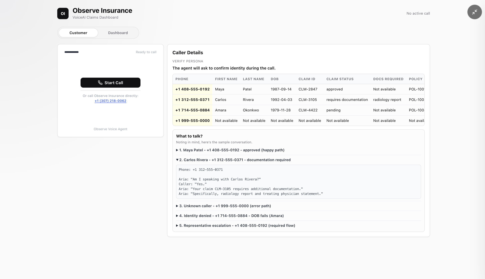
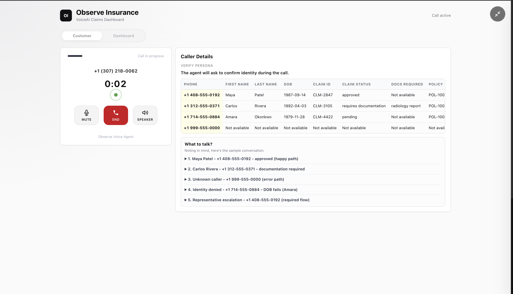
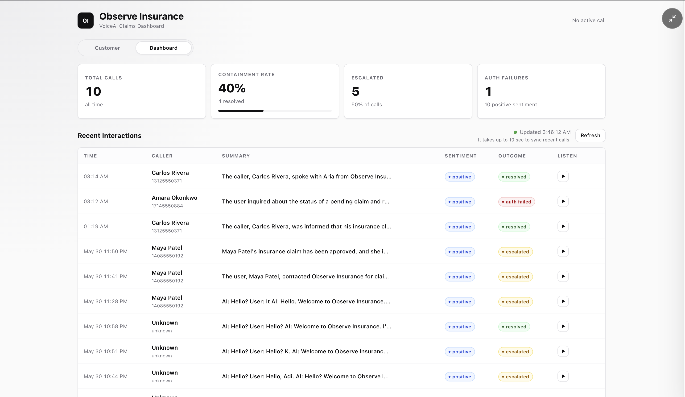
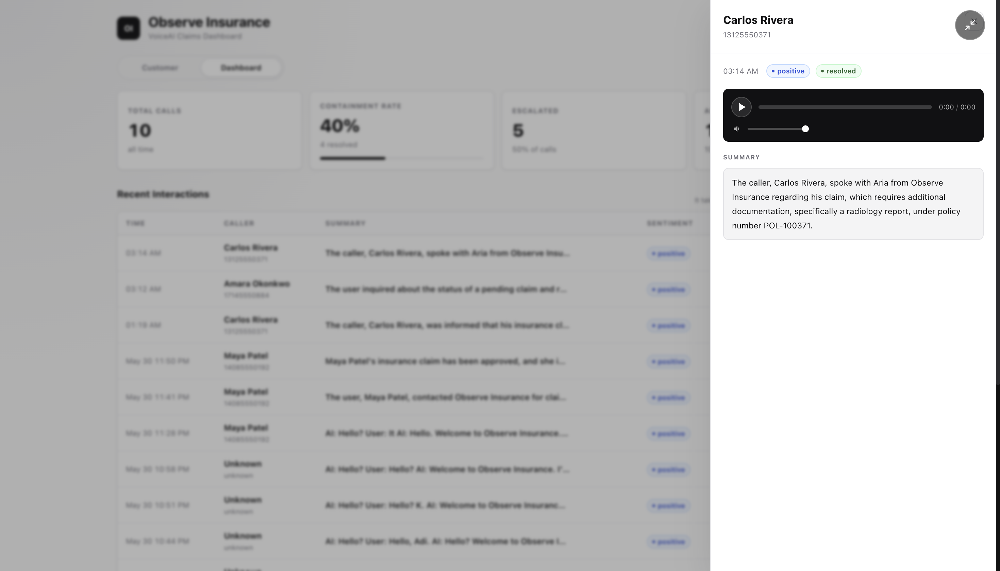

# Observe Insurance VoiceAI

Inbound claims-support voice agent for Observe Insurance - authentication, claim status, FAQ, escalation, and post-call logging - built with VAPI, Python/FastAPI, Google Sheets, and Airtable.

**Live :** https://www.heyashish.dev/voice-ai

**Demo :** https://www.loom.com/share/dcf6c771c2d24cc7803472143afcfaf6

## Tech Stack

- Python 3.11+, FastAPI, Uvicorn
- VAPI - voice pipeline (Deepgram STT, ElevenLabs TTS, Claude Sonnet 4.6)
- Google Sheets via `gspread` - integration #1 (caller lookup) + integration #2 (post-call log)
- Airtable via `pyairtable` - integration #3 / FAQ knowledge base
- OpenAI `gpt-4o-mini` - post-call summary generation (optional, degrades to transcript truncation if key absent)
- Plain HTML/CSS/JavaScript dashboard (no build step)

## Demo Callers

| Phone | Name | Claim | Status | Policy | ZIP |
| --- | --- | --- | --- | --- | --- |
| `+14085550192` | Maya Patel | `CLM-2847` | approved | `POL-100192` | `95110` |
| `+13125550371` | Carlos Rivera | `CLM-3105` | requires documentation | `POL-100371` | `60601` |
| `+17145550884` | Amara Okonkwo | `CLM-4422` | pending | `POL-100884` | `92801` |

**Demo flows:**

1. **Happy path** — call as Maya Patel, authenticate by name, get claim status, ask an FAQ, close
2. **Documentation flow** — call as Carlos Rivera, auth → agent delivers doc submission instructions
3. **Alternate phone (ZIP)** — call from an unknown number, give last name + correct ZIP → verified
4. **Alternate phone (DOB)** — call from unknown number, ZIP fails, give month-day DOB → verified
5. **Full verification failure** — all three checks fail → offered transfer → routed to live agent with notes
6. **Escalation — representative** — say "I want to speak to a representative" → immediate tagged transfer
7. **Escalation — unsupported question** — ask about billing/payments → polite redirect + transfer offer
8. **Emergency** — say any safety keyword → verbatim 911 redirect, call ends immediately
9. **Auth failure** — wrong name + wrong DOB on registered phone → lockout, graceful end

## Screenshots

**Customer page - ready to call**


**Active call - caller details + talk guide**


**Dashboard - call history, sentiment, outcomes**


**Conversation detail - summary + recording**


## Feature Coverage

| Feature | Implementation |
| --- | --- |
| Greeting & authentication | VAPI agent greets, collects phone, looks up caller in Google Sheets, confirms identity by name or DOB |
| Alternate phone verification | 3-step fallback when caller phones from unregistered number: name+ZIP (`verify_by_name_zip`) → name+DOB (`verify_by_name_dob`) → transfer with notes |
| Claim status | `compose_claim_response` implements CoVe (Dhuliawala et al. 2023) — re-fetches + validates server-side before speaking. Claim data never reaches LLM until auth passes. |
| Documentation instructions | Injected into claim response when status is `requires_documentation` |
| FAQ support | `answer_faq` tool — office hours, mailing address, new claim process, general claims info |
| Representative escalation | `escalate(reason='representative_requested')` tags call server-side → `transfer_to_agent` routes to live queue with notes pre-populated |
| Unsupported question handling | Out-of-scope requests (billing, payments, complaints) → polite redirect + offered transfer → `escalate(reason='unsupported_question')` if accepted |
| Emergency handling | Any safety keyword (911, harm, suicide, crisis) → verbatim 911 redirect → `escalate(reason='emergency')` → call ends; LLM does not continue |
| Post-call logging | `call-end` webhook writes caller name, summary, sentiment, escalation reason, and timestamp back to Google Sheets |
| Happy path | Auth → claim status → FAQ → close |
| Auth failure flow | Wrong name + wrong DOB → lockout, call ends gracefully |
| Multi-agent (bonus) | VAPI squad — triage agent (auth) → claims agent (status + FAQ) |
| Knowledge base (bonus) | Airtable FAQ table via `pyairtable` |

## Research Implementation - Chain-of-Verification (CoVe)

> **Paper:** "Chain-of-Verification Reduces Hallucination in Large Language Models"
> Dhuliawala et al., Meta AI, 2023 - [arXiv:2309.11495](https://arxiv.org/abs/2309.11495)

LLMs hallucinate facts when recalling structured data like claim IDs, statuses, or policy numbers. CoVe addresses this by making the model verify its own answers through a chain of independent checks before responding.

**Adaptation used here:**

Rather than asking the LLM to self-verify (which still risks hallucination), verification is moved entirely server-side. The `compose_claim_response` tool runs a strict 4-step pipeline before any claim data reaches voice output:

```
Step 1 - Auth guard:  authenticated_calls[call_id].phone must match requested phone
Step 2 - Re-fetch:    pull fresh record from Google Sheets (not from LLM memory or cache)
Step 3 - Validate:    claim_status must be in allowlist {approved, pending, requires_documentation}
Step 4 - Compose:     build the exact sentence the LLM speaks verbatim
```

The LLM never receives raw claim fields (`claimId`, `claimStatus`, `docsRequired`). It receives one pre-verified string and speaks it verbatim. If any step fails, `safeToSpeak: false` is returned and the agent escalates to a human representative instead of guessing.

This is a stricter adaptation than the original paper - verification runs in deterministic Python code rather than a secondary LLM pass, making it immune to model-level hallucination entirely.

**Implementation:** [`server/services/cove.py`](server/services/cove.py)

---

## Architecture Notes

**DOB privacy:** `verify_identity` compares DOB server-side. The value never reaches the LLM context.

**In-memory auth state:** `authenticated_calls` dict keyed by call ID. Sufficient for demo concurrency; swap for Redis in production.

**Multi-agent squad:** Voice platform squad routes triage agent (authentication) → claims agent (status + FAQ) on successful auth. Each agent has a focused system prompt.

**Post-call summary:** `gpt-4o-mini` generates a natural-language summary from the transcript after the call ends. Chosen for cost/latency on a non-realtime path. PII (phone, DOB) is redacted from the transcript before sending. Falls back to truncated transcript if `OPENAI_API_KEY` is absent.

## Tool Calls

Five server-side tools are called during a conversation. Every tool returns a JSON result the voice agent reads aloud or acts on.

| Tool | Arguments | Returns | Notes |
| --- | --- | --- | --- |
| `lookup_caller` | `phone: str` | `{found, firstName, lastName}` | Normalizes to E.164 before lookup. Returns identity fields **only** — claim data withheld pre-auth. Stores `{phone, caller_name}` in server-side `pending_callers`. |
| `confirm_identity` | `phone: str` | `{confirmed, variableValues: {authenticated, customer_name}}` | Verifies phone matches the earlier `lookup_caller` result server-side. On success, promotes call to `authenticated_calls`. LLM only receives the boolean. |
| `verify_identity` | `phone: str`, `dob: str` | `{verified, variableValues: {authenticated, customer_name}}` | Alt auth path (DOB instead of name). DOB compared server-side, never returned to LLM. Accepts spoken dates or partial MM-DD via `python-dateutil`. |
| `verify_by_name_zip` | `lastName: str`, `zipCode: str` | `{verified, firstName, variableValues}` | First alternate verification when caller phones from unregistered number. Scans all records by last name + 5-digit ZIP. Authenticates using registered phone from matched record. |
| `verify_by_name_dob` | `lastName: str`, `dob: str` | `{verified, firstName, variableValues}` | Second alternate verification (after ZIP fails). Accepts full YYYY-MM-DD or partial MM-DD. DOB never returned to LLM. |
| `escalate` | `reason: str` | `{logged, reason}` | Tags call server-side before any transfer. Reasons: `representative_requested`, `unsupported_question`, `emergency`. Captured in call_session so post-call log records escalation type. |
| `transfer_to_agent` | `reason: str` | VAPI transferCall | Routes caller to live agent queue. Always call `escalate()` first. |
| `answer_faq` | `question: str` | Plain-text answer string | Queries Airtable by keyword tag match. Falls back to canned support string if no match or Airtable unreachable. |
| `compose_claim_response` | `phone: str` | `{safeToSpeak: bool, response: str}` | Runs full CoVe pipeline (re-fetch + validate + compose). LLM speaks `response` verbatim only when `safeToSpeak` is `true`. Uses server-side `call_id`, not LLM-provided `callId` (template vars unreliable). |

### Tool dispatch flow

```
VAPI POST /webhook/tool
  └─ verify x-vapi-secret
  └─ parse message.toolCallList
  └─ for each tool call:
       look up handler in _DISPATCH
       if tool in _CALL_ID_TOOLS → pass server-side call_id
       return {toolCallId, result} JSON array
```

## Webhooks

| Method | Path | Auth | Trigger |
| --- | --- | --- | --- |
| `POST` | `/webhook/tool` | `x-vapi-secret` | Every tool call during a conversation |
| `POST` | `/webhook/tool-calls` | `x-vapi-secret` | Alias (older VAPI versions) |
| `POST` | `/webhook/tool_calls` | `x-vapi-secret` | Alias (underscore variant) |
| `POST` | `/webhook/call-end` | `x-vapi-secret` | End of call (direct VAPI serverUrl config) |
| `POST` | `/webhook/end-of-call-report` | `x-vapi-secret` | Alias (VAPI serverUrl convention) |

**Single serverUrl mode:** When configured with one `serverUrl` instead of separate `toolsUrl`/`serverUrl`, all message types arrive at `/webhook/tool`. The dispatcher detects `message.type == "end-of-call-report"` and routes it to the call-end handler automatically.

### Call-end webhook payload processing

```
POST /webhook/call-end
  └─ verify x-vapi-secret
  └─ extract: transcript, call_id, recording_url, transcript_url
  └─ resolve caller_phone and caller_name from call_session / pending_callers
  └─ classify_sentiment(transcript) → positive | negative | neutral
  └─ derive_outcome(transcript)     → resolved | escalated | auth_failed
  └─ generate_summary(transcript)   → gpt-4o-mini (degrades to truncation on failure)
  └─ log_interaction → Google Sheets interactions tab
  └─ 200 OK
```

## Knowledge Base

FAQ answers stored in Airtable with two columns: `tag` and `answer`.

| Tag | Example answer |
| --- | --- |
| `hours` | Office hours Mon–Fri 8 am–6 pm ET, closed weekends and federal holidays |
| `address` | Mailing address: 123 Insurance Way, Suite 400, Chicago IL 60601 |
| `new claim` | Start a new claim at observeinsurance.com/portal or call 1-800-555-0100 |
| `process` | Claims are reviewed within 5–7 business days after all documents are received |
| `document` | Upload to observeinsurance.com/portal or email support@observeinsurance.com |
| `escalate` | Transferring to a representative now - please hold |

**Matching logic:** `tag` checked for containment inside the caller's question (lowercase). Short keyword tags like `hours` match naturally-phrased questions like "what are your office hours?". First match wins. No match → `FAQ_FALLBACK` constant.

**Fallback chain:** Airtable unreachable → `FAQ_FALLBACK` string (never errors the call). Airtable credentials absent → logs error, returns `None` → `FAQ_FALLBACK`.

## Guardrails

### Authentication

| Guardrail | Where enforced | Detail |
| --- | --- | --- |
| Claim data withheld pre-auth | `lookup_caller` handler | Returns `firstName`, `lastName` only. `claimId`, `claimStatus`, `dob`, `docsRequired` never in response until auth succeeds. |
| Server-side auth state | `confirm_identity` / `verify_identity` | Auth stored in `authenticated_calls[call_id]` on the server. LLM cannot self-authenticate by crafting arguments. |
| Phone binding | `confirm_identity` | Phone provided must match what `lookup_caller` stored in `pending_callers`. Mismatches return `PHONE_MISMATCH` without touching auth state. |
| No pending lookup check | `confirm_identity` | If `lookup_caller` was never called for this `call_id`, returns `NO_PENDING_LOOKUP`. Prevents LLM from skipping lookup entirely. |
| DOB never in LLM context | `verify_identity` | DOB fetched server-side, compared in Python, then discarded. Only the boolean result is returned. |
| Three-strike lockout | VAPI system prompt | Agent ends the call gracefully after three failed authentication attempts. |

### Claim response (CoVe pipeline)

See [Research Implementation](#research-implementation---chain-of-verification-cove) above for the full 4-step breakdown.

### Transport / API

| Guardrail | Detail |
| --- | --- |
| VAPI secret verification | Every webhook checks `x-vapi-secret` header (or `Authorization: Bearer`) against `VAPI_WEBHOOK_SECRET`. Returns 401 on mismatch. |
| Rate limiting | `/webhook/tool` - 60 req/min; `/webhook/call-end` - 30 req/min (slowapi, keyed by IP). |
| Request ID tracing | Every request gets a UUID injected into `request.state` and echoed in `X-Request-ID` response header. All log lines carry it. |
| Global exception handler | Unhandled exceptions return `500 + request_id` - no stack traces exposed to caller. |
| Dashboard auth | `/api/interactions` requires `Authorization: Bearer <DASHBOARD_SECRET>` or `X-Dashboard-Secret` header when `DASHBOARD_SECRET` is set. Open only in local dev. |
| PII redaction before LLM | `redact_pii()` strips phone numbers and DOB patterns from transcripts before sending to OpenAI for summary generation. |
| Call-end phone resolution priority | `customer.number` (PSTN) → `call_session.phone` (post-auth) → `pending_callers.phone` (pre-auth) → `"unknown"`. Never fails the log write due to missing phone. |

### State

| Guardrail | Detail |
| --- | --- |
| TTL eviction | `authenticated_calls`, `pending_callers`, `call_session` entries expire after 4 hours. Eviction runs on every `save_state` and `load_state`. |
| State persistence | State written to `/tmp/call_state.json` on auth events. Survives process restarts (single-worker). Swap for Redis in multi-worker production. |
| `call_id` server-side only | `compose_claim_response` ignores the LLM-provided `callId` argument and uses the server-side `call_id` extracted from the webhook body. VAPI template variable substitution is unreliable. |

## API Endpoints

| Method | Path | Auth | Description |
| --- | --- | --- | --- |
| `GET` | `/health` | None | Runs Sheets + Airtable connectivity checks. Returns `status: ok` or `degraded`. |
| `GET` | `/api/config` | None | Returns `vapiPublicKey` + `vapiAssistantId` for the browser SDK. Never exposes `DASHBOARD_SECRET`. |
| `GET` | `/api/interactions` | `DASHBOARD_SECRET` (when set) | Returns all logged call interactions for the dashboard. TTL-cached 20 s. |
| `POST` | `/webhook/tool` | `VAPI_WEBHOOK_SECRET` | Handles VAPI tool calls (and end-of-call reports in single-serverUrl mode). |
| `POST` | `/webhook/call-end` | `VAPI_WEBHOOK_SECRET` | Logs post-call summary, sentiment, and outcome to Sheets. |
| `GET` | `/client/` | None | Serves the static dashboard. |

---

## Project Structure

```text
.
├── client/
│   ├── index.html          # Dashboard UI
│   ├── app.js              # Polls /api/interactions
│   ├── constants.js        # Client constants
│   └── styles.css
├── data/
│   └── seed.py             # Seeds demo callers and sheet headers
├── server/
│   ├── main.py             # FastAPI app, middleware, routers, static client mount
│   ├── core/               # Config, auth, phone normalization, logging, state
│   ├── routes/             # Health, interactions, VAPI webhook routes
│   ├── services/           # Sheets, FAQ, CoVe, summaries, tool dispatch
│   └── models/             # Typed domain models
├── tests/                  # Unit tests
├── .env.example            # Environment template
├── Procfile                # Heroku-style process command
├── render.yaml             # Render deployment config
└── requirements.txt
```

## Environment

```bash
cp .env.example .env
```

Required:

```env
VAPI_WEBHOOK_SECRET=your-webhook-secret-here
GOOGLE_SPREADSHEET_ID=your-spreadsheet-id-here
GOOGLE_CREDENTIALS_JSON={"type":"service_account","project_id":"..."}
```

Optional:

```env
AIRTABLE_API_KEY=your-airtable-api-key-here
AIRTABLE_BASE_ID=your-airtable-base-id-here
OPENAI_API_KEY=your-openai-api-key-here
DASHBOARD_SECRET=your-dashboard-secret-here
PORT=3000
```

`DASHBOARD_SECRET` controls access to `/api/interactions`, which returns call PII (caller phone, name, summaries, recording URLs). When set, the dashboard prompts on first load - enter the secret once, held in `sessionStorage` for the session. Unset = open endpoint (local dev only).

`GOOGLE_CREDENTIALS_JSON` - full service-account JSON as a single line. Share the target spreadsheet with the service-account email before seeding.

## Google Sheets Setup

Create a spreadsheet with two tabs: `callers` and `interactions`, then seed:

```bash
python data/seed.py
```

## Local Development

```bash
python -m venv .venv
source .venv/bin/activate
pip install -r requirements.txt
uvicorn server.main:app --reload --host 0.0.0.0 --port 3000
```

- API health: `http://localhost:3000/health`
- Dashboard: `http://localhost:3000/client/`
- Interactions JSON: `http://localhost:3000/api/interactions`

Expose webhooks publicly:

```bash
ngrok http 3000
```

## Webhook Configuration

| Event | URL |
| --- | --- |
| Tool calls | `https://<your-domain>/webhook/tool` |
| End of call | `https://<your-domain>/webhook/call-end` |

Add to both webhook configs:

```text
x-vapi-secret: <VAPI_WEBHOOK_SECRET>
```

## Testing

```bash
pytest
```

Covers phone normalization, sentiment classification, CoVe claim-response safety (all 4 steps), tool dispatch, webhook auth, dashboard auth, and confirm-identity guards.

## Deployment

Build:

```bash
pip install -r requirements.txt
```

Start:

```bash
uvicorn server.main:app --host 0.0.0.0 --port $PORT
```

Set env vars from `.env.example` in the hosting provider. Dashboard served by FastAPI at `/client/` - no separate frontend build step.
